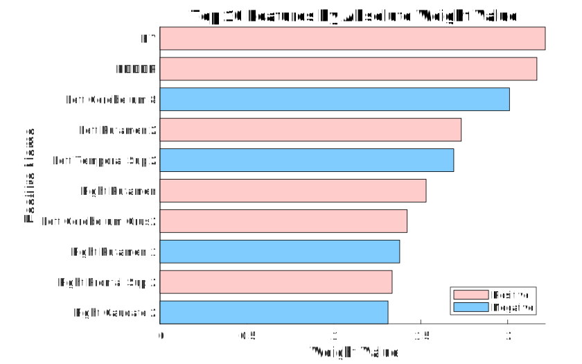

# PPMI_regression_82subs

This project contains code and data for regression analysis on Parkinson's disease (PD) using data from 82 subjects.

## About

This repository includes MATLAB scripts for performing regression analysis on PD data, as well as visualization tools and results. The main components are:

- `main.m`: Main script to run the analysis
- `regression_with_BayesOpt.m`: Performs regression with Bayesian optimization
- `calculate_metrics.m`: Calculates performance metrics
- `plot_*.m` files: Various plotting functions
- `data.mat` and `data_fMRI.mat`: Data files
- `feature_names.txt`: Contains names of features used in the analysis
- `MNI152_T1_2mm_Brain.nii.gz`: MNI152 2mm brain template
- `MNI152_T1_2mm_Brain_Mask.nii.gz`: Brain mask in MNI152 2mm space
- `Schaefer2018_100Parcels_7Networks_w_SubCortAtlas_MNI152_2mm.nii.gz`: Schaefer 2018 brain atlas with 100 parcels and 7 networks in MNI152 2mm space

## Usage

To run the analysis:

1. Ensure you have MATLAB installed
2. Clone this repository
3. Open MATLAB and navigate to the project directory
4. Run `main.m`

## Results

The analysis generates several result figures:

### 1. Bayesian Optimization Model

### 2. MDS-UPDRS Actual vs Predicted Total Scores Scatter Plot

### 3. Weight Bar Chart

### 4. ROI Visualization

These figures provide visual representations of the regression analysis results and can be found in the `figures/` directory.

## Acknowledgements

This project uses the `tight_subplot` function by Pekka Kumpulainen, available on [MATLAB File Exchange](https://www.mathworks.com/matlabcentral/fileexchange/27991-tight_subplot-nh-nw-gap-marg_h-marg_w).

## License

This project is licensed under the GNU General Public License v3.0 (GPL-3.0). See the [LICENSE](LICENSE) file for details.

## Contact

Jing Wang - wangjing@xynu.edu.cn

Project Link: [https://github.com/yuzhounh/PD_regression_82subs](https://github.com/yuzhounh/PD_regression_82subs)